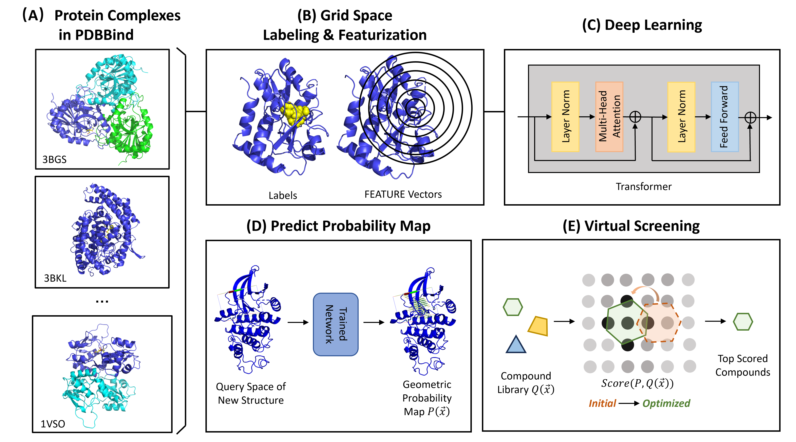

## Project Aim
The hypothesis is that the protein-ligand interaction map depends only on local environments instead of the whole protein. This model predicts the geometric preference of ligand given a protein pocket. The trained neural network can predict probability maps of novel query structures. Such s probability map can be used to pick potential binding ligands from existing small compound libraries based on a custom scoring function encoding the probabilities.



## Setup Environment
```bash
conda create -n featdock python=3.8
conda activate featdock
conda install pytorch torchvision torchaudio pytorch-cuda=11.7 -c pytorch -c nvidia # pytorch 2.0
conda install "numpy>=1.23.5"
conda install pandas matplotlib pygraphviz
conda install -c conda-forge scipy=1.8.0
pip install scikit-learn==1.0.2
conda install -c salilab dssp # dssp 3.0.0
conda install -c conda-forge pymol-open-source
pip install rdkit==2022.9.5
pip install tqdm
```

Unzip `utils/feature-3.1.0.zip`.

In case that `dssp` cannot be correctly installed via `conda`, please use the `dssp` binary file in `src/utils`.
```bash
PROJ_HOME=FeatureDock
export PATH=${PROJ_HOME}/src/utils:${PATH}
dssp --version
```

<!-- conda install -c conda-forge -c schrodinger pymol-bundle # pymol 2.5.2
conda install -c pytorch captum # exlainable-AI -->

## Predict
Run a quick prediction using one trained model:
```bash
PROJ_HOME=FeatureDock
MODELREPO=${PROJ_HOME}/results/vit_20
MODELTYPE=transformer
SEED=0
MODELNAME=${TASK}_${MODELTYPE}_${NBLOCKS}_seed${SEED}
PRED_DIR=${PROJ_HOME}/examples
name=1b38

python ${SCRIPT_HOME}/application/predict_main.py \
    --configfile=${MODELREPO}/${MODELNAME}/${MODELNAME}_config.torch \
    --paramfile=${MODELREPO}/${MODELNAME}/${MODELNAME}_best_checkpoint_params.torch \
    --datafile=${PRED_DIR}/aligned_merged_pocket/${name}.property.pvar \
    --outfile=${PRED_DIR}/${name}_seed${SEED}.predictions.pkl \
    --batchsize=10000
```

To visualize the predictions, one way is to output xyz files that contains grid points above certain probabilities:
```bash
python ${SCRIPT_HOME}/application/plot_prediction.py \
    --voxelfile=${PRED_DIR}/aligned_merged_pocket/${name}.voxels.pkl \
    --probfile=${PRED_DIR}/${name}_seed${SEED}.predictions.pkl \
    --outdir=${PRED_DIR}/${name}_xyz \
    --cutoffs 0.8 0.9 0.95
```

Another way is to plot the colored predicted probability map in PyMol. Run the following command in PyMol terminal: 
```python
# Run script: src/application/plot_probability_map.py
plot_probability(probfile, voxelfile, cutoff=0.8, colormap='Blues', relative=True, is_rank=False, plot_every=1)
```

**Note**: How to install `matplotlib` to the PyMol environment:
```bash
conda install -p ${PYMOL_PATH} matplotlib
```


## Complete workflow
1. Prerequisites: `commands/step1_download_prerequisites.sh`
2. Dataset curation: `commands/step2_1_curate_dataset_commands.sh`, `commnds/step2_2_split_dataset_for_general_model.sh`
3. Training: `commands/step3_train_general_model.sh`
4. Evaluation: `commands/step4_evaluate_commands.sh`
5. Prediction: `commands/step5_predict_commands.sh`
6. An example of applying FeatureDock to virtual screen the inactivated CDK2: `examples/step6_apply_prediction.sh`.


## Curate Dataset
A few comments and explanations for step 1 and step2.

### Prerequisite Data and Packages
1. Download and unzip [PDBbind_v2020_refined.tar.gz](http://www.pdbbind.org.cn/download/PDBbind_v2020_refined.tar.gz).

2. Download and install [GNU Parallel](https://www.gnu.org/software/parallel/). This is used to parallel commands in dataset curation.
```bash
sudo apt-get install parallel
parallel --version
```

### Dataset explanations
The training dataset is curated by (1) discretizing the ligand-binding pocket to grid points, (2) featurizing each grid point using FEATURE vectors, and (3) labeling each grid point using ligand properties in the cocrystal structure.

1. `HETATM` such as ions in protein structures will be removed.
2. Secondary structures of apo proteins will be calculated for FEATURE vector calculation.
3. Space around the ligand will be discretized to grid points
4. Landmarks based on ligand or protein-ligand interactions will be created.
5. Grid points will be labeled based on landmarks.

Commands can be found in `commands/step2_1curate_dataset_commands.sh`. The size of FEATURE property pickle file is 10~15MB and there are ~4500 of such files. The program will generate some intermediate output files to help visualise the dataset when flagged in the Python scripts. Therefore, the curated dataset needs at least 100GB disk space.


## How to Cite
To be updated

## References
1. Halperin, I., Glazer, D. S., Wu, S., & Altman, R. B. The FEATURE framework for protein function annotation: modeling new functions, improving performance, and extending to novel applications. In BMC Genomics (Vol. 9, Issue S2). https://doi.org/10.1186/1471-2164-9-s2-s2
2. Lam, J.H., Li, Y., Zhu, L. et al. A deep learning framework to predict binding preference of RNA constituents on protein surface. Nat Commun 10, 4941 (2019). https://doi.org/10.1038/s41467-019-12920-0
3. Bouysset, C., Fiorucci, S. ProLIF: a library to encode molecular interactions as fingerprints. J Cheminform 13, 72 (2021). https://doi.org/10.1186/s13321-021-00548-6

## License
MIT License

